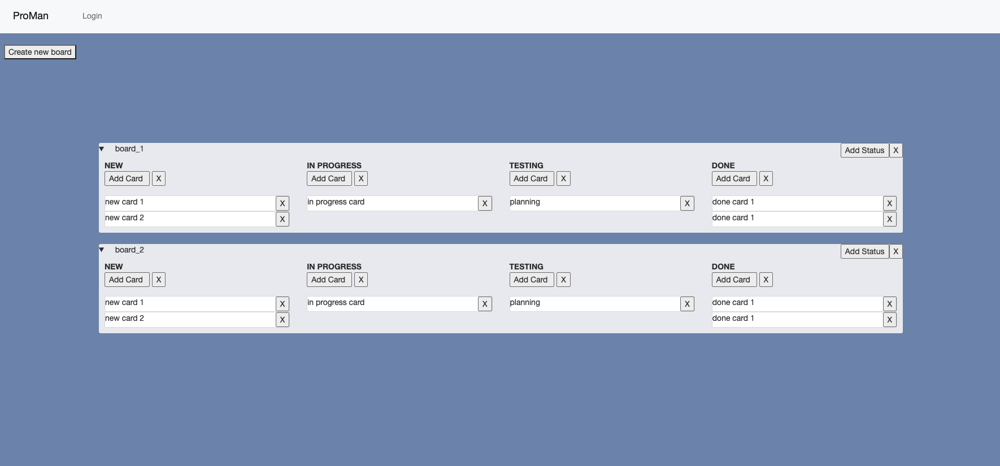

# ProMan

## Description

This is a project management tool similar to Trello. You can make boards with columns and cards to manage your tasks.

## Implemented

- Create boards
- Add card
- Add columns
- Delete
- Rename everything
- Drag and Drop cards
- Login and Registration system with password hashing
- All data saved in PostgreSQL database

## Technologies

- Python
- JavaScript
- Ajax
- HTML
- SQL
